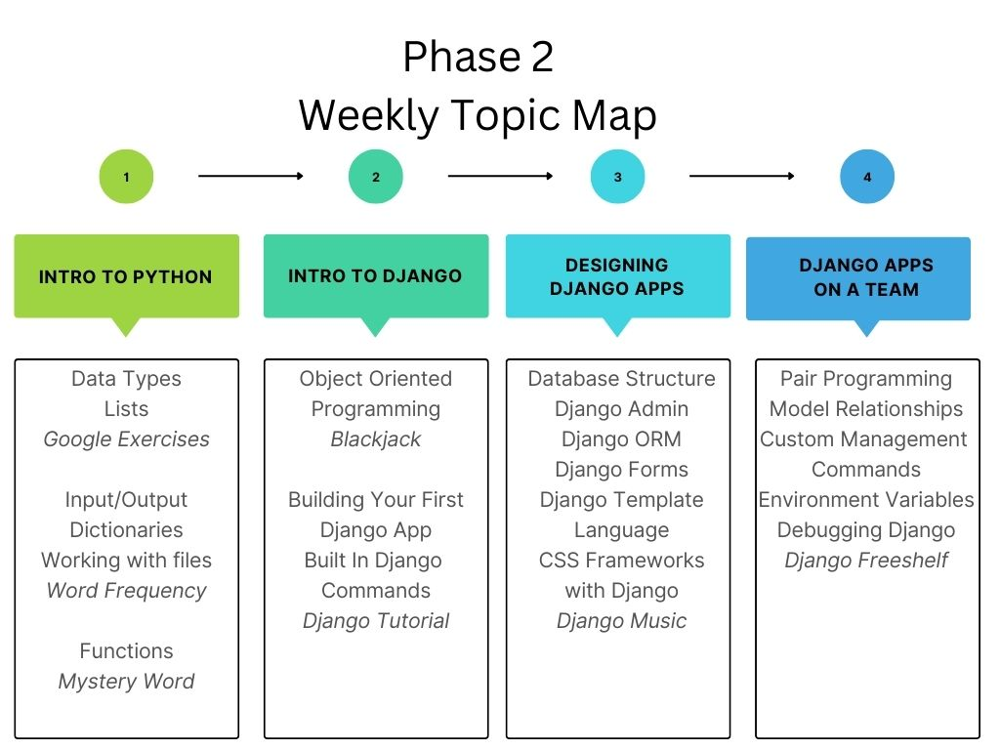

Welcome to Phase 2, where we'll be learning about back end development. The overview of topics we are covering and assignments is here:

## 🗓️ Today's topics

- Running Python
- Syntax differences between JS and Python
- Python
  - variables
  - `if` statements
  - `while` loops
  - Input and output with `input` and `print`
  - Functions

## 🎯 Project

In class and for homework, we will work on the exercises from Google's Python course.

- [Link](https://classroom.github.com/a/z5V5ejzn) to accept assignment

## 🔖 Reference Material

### Essential Python References

- ⭐ [Official Python docs](https://docs.python.org/3/)
- 🐍 [The Python Standard Library](https://docs.python.org/3/library/index.html)
- [LearnPython Tutorial](https://www.learnpython.org/) -> A good reference with examples and exercises.
- [A Byte of Python](https://python.swaroopch.com/) -> Use this as a reference, starting at First Steps. DO NOT follow the installation instructions to download Python -- you already have Python installed!

## 🦉 Code & Notes

- [Notes: Intro to Python](https://github.com/momentum-team-16/notes/blob/main/py-intro.md)
